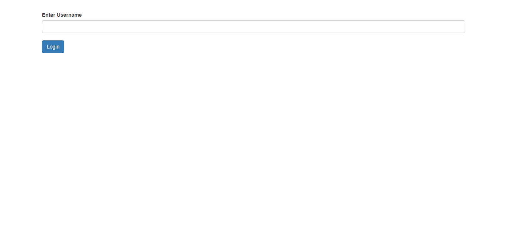
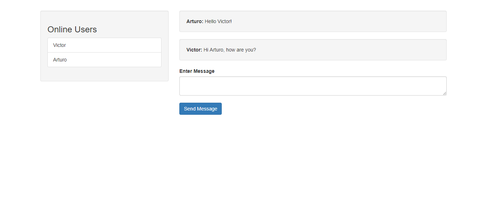

# Socket.io Chat
This is a simple socket.io chat used to learn Socket.io, using Express, Socket.io, Node.js, Bootstrap 3 and JQuery 3.3.1.

## Features:
- Users connected list.
- Send messages.
- Receive messages.
- Simple login page.
- Receive all the previous messages before your login.

**All these features are in realtime.**

My improve for this project was ***Receive all the previous messages before your login.***

### How to run this app:
open a terminal inside the project folder and run the following code, **but first make sure that you have installed node.js**, then open your browser at http://localhost:3000/ and you will see the project working on your browser
```bash
node .
```

### Preview of the project:

#### Login page:


#### Main page:
